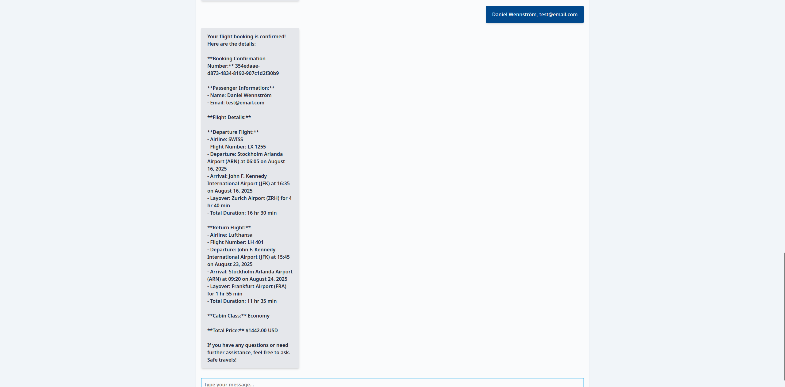

# ✈️ Flight Booking Frontend - Project Test

A web application that provides a chatbot interface for flight booking. This frontend connects to the Flight Booking API to deliver a fairly seamless flight search and booking experience powered by AI.

**Note: This frontend requires the backend API to function. See https://github.com/danielwennstrom/FlightBooking_API**

## Screenshots

| Chatbot & Destination Picker | Flight Selection (Desktop) | Flight Selection (Mobile) | Booking Confirmation |
|:---:|:---:|:---:|:---:|
|  |  |   |  | |

*Click images for full resolution*

## Key Features

- **AI Chatbot Interface**: Natural language flight booking conversations
- **Flight-related questions**: Will answer questions regarding flights and aviation in general to hopefully help the user make smarter trip planning decisions
- **Flight Search**: Browse and compare real-time flight options
- **Airport Selection**: Airport picker with data from comprehensive database
- **Booking Management**: View and cancel existing reservations through the chatbot

## Known Limitations

- Yes.
- Requires a lot of refactoring from lessons learnt (and unimplemented features due to lack of time) during this project, and as such some widgets and the UX in general might be slightly janky.
- Picking flights is only possible through the dedicated widget, the rest such as deciding on airports and dates can be done in the 'text mode' with natural language.
- Asking questions in-between the use of the visual tools isn't especially seamless.
- Requires active internet connection for real-time flight data.
- Booking simulation only - no actual flight purchases.
- AI responses depend on OpenAI API availability.

## Built With

- React
- TypeScript
- Tailwind CSS
- React-Select, date-fns, axios

## Prerequisites

- Node.js 16+
- npm or yarn
- Running instance of Flight Booking API (see backend repository)

## Quick Start

1. Clone the repository
2. Install dependencies: `npm install`
3. Start development server: `npm start`
4. Open browser to `http://localhost:5173` (or specified port)
5. Ensure backend API is running at `http://localhost:8080`

## Usage

1. **Start a Conversation**: Type your flight booking request in natural language, ask questions, or pick one of the example prompts below the welcome message.
2. **Visual aid**: Visual tools such as a date picker and destination picker are presented first, but most functionality (except for selecting flights) can also be done through natural language
3. **Search Flights**: The AI will parse and help you find flights based on your preferences
4. **Select Flights**: Browse available options with real-time pricing
5. **Book Your Flight**: Provide passenger details to complete your booking
6. **Manage Bookings**: View or cancel existing reservations

## TODO

- More robust handling of null responses
- Handle tool responses in a more stateless manner to allow asking questions while using the widgets, and especially to avoid having to re-render elements needlessly
- Implement useEffect hooks for the earliest implementations of the widgets (such as the date picker and destination picker)
- Fix Flight Picker CSS

## API Integration

This frontend communicates with the Flight Booking API endpoints:

- Chat processing for AI conversations
- Flight search and selection
- Airport data retrieval

## Credits

- **DataCrawler** at RapidAPI for their Google Flights API (https://rapidapi.com/DataCrawler/api/google-flights2)
- **OurAirports** for their open airports data (https://ourairports.com/data/)
- **OpenAI** for providing the AI conversation capabilities
- **Lexicon** - This project was created as part of their Java course
